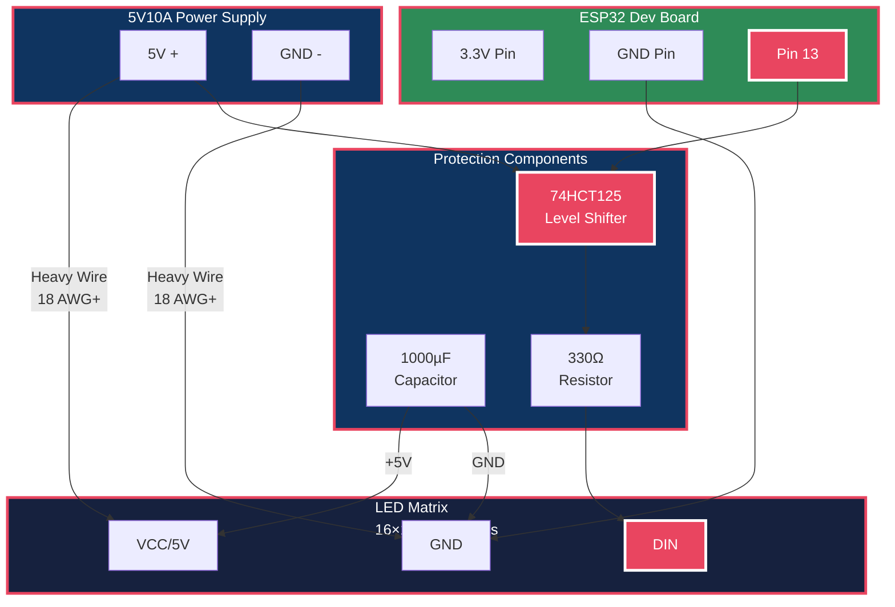

# LED Matrix Wiring Guide
# 16×16 Matrix with ESP32 Dev Board

Generated on: 2025-07-20 18:00:32

## Configuration Summary:
- Controller: ESP32 Dev Board
- Matrix Size: 16×16 (256 LEDs)
- Data Pin: 13
- Power Supply: 5V10A
- Level Shifter Required: Yes

## Mermaid Wiring Diagram:

## Connection List for 16×16 LED Matrix

### Power Connections (Use heavy wire - 18 AWG or thicker):
- Power Supply 5V+ → LED Matrix VCC/5V
- Power Supply GND → LED Matrix GND
- Power Supply GND → ESP32 Dev Board GND

### Data Connection:
- ESP32 Dev Board Pin 13 → 74HCT125 Level Shifter → 330Ω Resistor → LED Matrix DIN
- Power Supply 5V+ → 74HCT125 VCC (to power the level shifter)

### Level Shifter Connections (74HCT125):
- VCC → Power Supply 5V+
- GND → Common Ground
- Input → ESP32 Dev Board Pin 13
- Output → 330Ω Resistor → LED Matrix DIN

### Protection Components:
- 1000µF Capacitor: + terminal to LED Matrix VCC, - terminal to LED Matrix GND
- Place capacitor as close to the LED strip as possible
- 330Ω Resistor in series with data line

### Power Requirements:
- Total LEDs: {power_req['total_leds']}
- Maximum Current: {power_req['total_current_amps']:.2f}A
- Recommended PSU: {psu} ({self.power_supplies[psu]['current']})
- Safety Margin: {power_req['safety_margin_percent']}% included in recommendation

## Troubleshooting Guide for ESP32 Dev Board

### Common Issues and Solutions:

#### LEDs Not Lighting Up:
- Check power supply connections (5V+ and GND)
- Verify data pin connection (Pin should be connected to DIN through 330Ω resistor)
- Ensure power supply is adequate for the number of LEDs
- Test with a simple sketch that lights up first 10 LEDs

#### Flickering or Unstable Colors:
- Add or check 1000µF capacitor across power rails near LED strip
- Verify power supply capacity (should be 20% higher than calculated requirement)
- Check for loose connections, especially power connections
- Reduce brightness in code if power supply is marginal

#### Wrong Colors or Patterns:
- Verify LED type in code (WS2812B vs WS2811)
- Check color order (GRB vs RGB) in FastLED configuration
- Ensure proper XY mapping function for your wiring pattern

#### ESP32 Dev Board Specific Issues:
- Verify 74HCT125 level shifter connections
- Ensure level shifter is powered with 5V (not 3.3V)
- Check that ESP32 Dev Board Pin 13 is connected to level shifter input
- Verify level shifter output goes to 330Ω resistor then to LED DIN

#### Serial Communication Issues (Arduino IDE):
- Close Arduino IDE Serial Monitor before running Python scripts
- Verify correct COM port in Device Manager (Windows) or ls /dev/tty* (Linux/Mac)
- Try different baud rates (115200, 500000)
- Check USB cable (some cables are power-only)

### Testing Procedure:
1. Start with 10 LEDs maximum for initial testing
2. Use a simple solid color test (red, green, blue)
3. Verify power consumption with multimeter
4. Gradually increase LED count after confirming basic operation
5. Test with full matrix only after partial testing succeeds

### Safety Reminders:
- Always disconnect power when making wiring changes
- Use fused power supplies when possible
- Monitor temperature during extended operation
- Start with low brightness (25%) for initial testing

## Additional Resources:
- FastLED Library: https://github.com/FastLED/FastLED
- WS2812B Datasheet: Available from LED strip manufacturer
- Power Supply Calculator: Use 60mA per LED maximum
- Arduino IDE: https://www.arduino.cc/en/software

---
Generated by LED Matrix Wiring Diagram Generator
